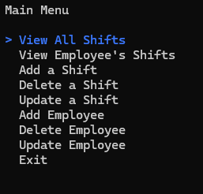

# Console-ShiftTracker
This project served as an opportunity to learn writing a web API with ASP.NET core. The solution consists of two projects, one which builds the API and database and simulates the "server" and one which simulates the "client" by allowing the user to send requests and view data. 

## Features
- Track shifts per employee. Add, edit, or delete both shifts and employee with a responsive database (delete the employee? All their shifts are gone too!)

## Getting started
- After cloning repo, make sure you have MSSQL server set up.
- IMPORTANT: replace your own MSSQL server information in the OnConfiguring method of ShiftLogContext.cs.
- Log those shifts!

## Comments
- While this is just a simple project meant for learning about APIs and practicing the repository pattern, all are welcome to use this as a template for an ASP.net API or any other purpose you can think of.